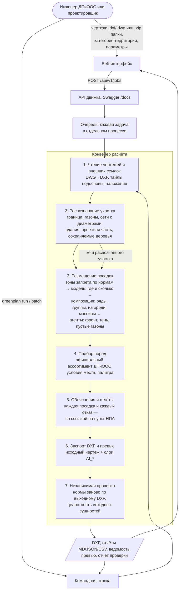

# GreenPlan — автоматическое проектирование озеленения с учётом подземных коммуникаций

Решение задачи №3 Международного хакатона 2026: **«Сервис для автоматического проектирования
озеленения города с учётом расположения подземных коммуникаций и городской среды»**
(ДПиООС города Москвы).

Вход — чертежи объекта в DXF. Выход — **тот же чертёж** с дописанными слоями `AI_*`
(деревья, кустарники, нормативные зоны, корнезащита, отказы) и отчёты, в которых
**каждая посадка и каждый отказ объяснены ссылкой на пункт нормативного документа**.

Главное правило: нормативное решение принимает геометрия, а не модель. Модель, обученная на
проектных решениях датасета, предлагает **где и сколько** сажать — ряды вдоль аллей, группы
деревьев, куртины и изгороди кустарника, как это делают проектировщики; каждая её точка проходит
тот же нормативный фильтр, а норматив плотности ТСН остаётся верхним пределом. Без модели
(`--no-ml`, в веб-интерфейсе — снять галочку) система полностью работоспособна по правилам,
весь расчёт идёт офлайн.

---

## Быстрый старт

```bash
docker compose up --build
```

- веб-интерфейс — <http://localhost:8080>
- API и Swagger — <http://localhost:8000/docs>

Без Docker:

```powershell
py -3.11 -m venv .venv
.\.venv\Scripts\python.exe -m pip install -e engine
.\.venv\Scripts\greenplan.exe run --input "Генплан.dxf" "Геоподоснова.dxf" --output out
```

Демонстрация на объекте датасета — `scripts\demo.ps1`. Пакетный прогон датасета —
`greenplan batch --dataset-root <папка датасета> --output out --workers 3`: объекты считаются
параллельно, каждому процессу нужно до 3 ГБ памяти; на 6 ядрах и 16 ГБ 12 объектов считаются за
23 минуты вместо 66.

Распознанный участок кешируется по содержимому чертежей и версии правил распознавания: повторный
расчёт того же чертежа — например, с галочкой превышения норматива — пропускает чтение и
распознавание, а это около половины времени (Макеева: 135 → 68 с; весь датасет с превышением после
прогона по нормативу — 14 минут вместо 69). Нейросеть занимает около 1,5 с на объект, поэтому GPU
для расчёта не нужен; время уходит на разбор DXF, геометрию норм и независимую проверку результата.

## Что получается на выходе

| Файл | Содержание |
|---|---|
| `<имя>_greenplan.dxf` | исходный чертёж **плюс** слои `AI_*`; у каждой посадки атрибут `ID` и XDATA `GREENPLAN` |
| `planting_report.md` / `.json` / `.csv` | объяснение каждой посадки и каждого отказа: нормы, числа, пункт НПА, обоснование породы |
| `volumes.csv` | ведомость объёмов: породы, количества, газон, корнезащита |
| `preview.png` | схема участка: зоны, посадки, отказы |
| `verification_report.md` / `.json` | независимая проверка результата и целостности исходных слоёв |
| `run_summary.json` | параметры прогона, время и память по этапам |

## Как это работает



Нормы — единственный источник решения «можно или нельзя»: модель и композиция только предлагают
места и форму посадок, а каждая точка проходит тот же фильтр отступов, что и в проверке. Без модели
(`--no-ml`, в веб-интерфейсе — снять галочку) этап 3 работает по правилам, остальные этапы не
меняются. Кеш распознанного участка ключуется содержимым всех чертежей объекта и версией правил
распознавания, поэтому повторный расчёт с другими параметрами начинается сразу с этапа 3.

---

## Результаты на датасете «Пилотный проект 20 улиц»

Первый пакетный прогон 12 объектов по правилам (`greenplan batch --no-ml`, ноутбук разработчика,
категория территории «улица районного значения», 23.09.2026; актуальные прогоны модели и семи
новых объектов — ниже):

| Объект | Деревья | Кустарники | Условно, с корнезащитой | Отказы с объяснением | Нарушения после проверки | Исходник цел | Время, мин |
|---|---:|---:|---:|---:|---:|:---:|---:|
| 1. Олимпийская деревня | 223 | 907 | 0 | 328 | 0 | да | 7,7 |
| 4. Харьковская улица | 130 | 529 | 0 | 258 | 0 | да | 7,6 |
| 5. Багрицкого улица | 179 | 1 098 | 105 | 260 | 0 | да | 3,2 |
| 6. Камчатская улица | 198 | 798 | 0 | 265 | 0 | да | 2,5 |
| 7. Нижние Поля ул | 272 | 1 180 | 150 | 230 | 0 | да | 4,7 |
| 8. Лодочная | 200 | 1 194 | 126 | 254 | 0 | да | 5,2 |
| 9. Измайловская площадь | 689 | 2 757 | 0 | 39 | 0 | да | 2,6 |
| 10. Старый Гай ул | 133 | 532 | 0 | 148 | 0 | да | 2,7 |
| 12. Наташинский пр-д | 219 | 1 047 | 138 | 230 | 0 | да | 8,4 |
| 13. Харьковский проезд | 403 | 1 826 | 0 | 165 | 0 | да | 5,3 |
| 16. улица Берзарина | 0 | 0 | 0 | 0 | 0 | да | 5,5 |
| 20. Макеева С. ул | 274 | 1 099 | 0 | 25 | 0 | да | 1,9 |

Итого 2 920 деревьев и 12 967 кустарников; независимая проверка не нашла ни одного нарушения,
исходные сущности чертежей целы на всех объектах. Весь прогон — 57 минут, самый тяжёлый объект —
8,4 минуты, пиковая память — 2,2 ГБ (бюджет постановщика: подбор мест ≤ 30 минут, память ≤ 8 ГБ).
В контейнере на Linux объект Багрицкого, поданный в DXF, даёт те же посадки, породы, статусы
и отказы, что и на Windows по DWG; длина корнезащиты расходится на 0,05 %.

Что надо знать о данных: у Измайловской площади, Берзарина и Макеева в выданных файлах нет
подземных сетей (у Измайловской геоподоснова выгружена со всей графикой на одном слое) — отчёт
предупреждает, что план без геоподосновы согласовывать нельзя; у Берзарина нет ни границы работ,
ни газона, поэтому посадок нет.

### Как план становится похожим на работу проектировщика

Проектировщик мыслит не точками, а элементами: аллея одной породы с ровным шагом вдоль улицы,
группа из 3–5 деревьев, солитёр на открытом газоне, живая изгородь у тротуара, куртина цветущего
кустарника; повторяет ограниченную палитру пород и оставляет газон открытым. Замеры эталонов
датасета это подтверждают: 40–60 % деревьев стоят в рядах, группы по 3–4 дерева, 5–8 пород на
объект, соседние деревья одной породы в 50–75 % случаев.

Поэтому план строится в два слоя:

1. **Где уместна посадка** — модель `models/greenplan-guidance.onnx` (U-Net по 14 геометрическим
   каналам участка: газон, расстояния до сетей, краёв проезжей части и тротуара, зданий,
   сохраняемых деревьев), обученная на проектных решениях шести объектов и откалиброванная на трёх
   отложенных. Она же даёт ожидаемое количество; норматив ТСН — верхний предел.
2. **Как посадить** — композиция: ряды деревьев вдоль краёв газона (в первую очередь вдоль
   проезжей части), группы, солитёры; кустарник — как рисуют проектировщики: сначала крупные
   куртины неправильной формы (до сотни кустов) там, где газон достаточно глубок и модель
   уверена, что проектировщик посадил бы кустарник, затем полосы в два-три ряда вдоль краёв газона
   (в первую очередь вдоль рядов деревьев — аллея с живой изгородью), живые изгороди и мелкие
   группы. Элемент проходит нормы
   целиком, ряды и группы ставятся только там, где нормы выполнены без корнезащиты, порода
   подбирается на элемент, палитра участка — до шести пород деревьев и шести кустарника.
3. **Агенты с ролями доводят план.** Аналитик улицы ищет фронт проезжей части без защитной
   посадки, тротуары без тени, пустые участки газона 30×30 м и группы деревьев без подлеска;
   координатор закрывает найденное элементами из резерва в 25 % количества, каждая добавленная
   посадка проходит те же нормы, журнал решений попадает в отчёт и веб-интерфейс.

Если модель ожидает деревьев меньше 30 % норматива (на Макеева — 19 при допустимых 274), количество
поднимается до этого минимума, недостающие места выбираются по оценке модели и правилам, а отчёт
объясняет, почему деревьев больше, чем предложила модель.

Норматив плотности ТСН — рекомендательный, и проектировщики датасета его превышают в разы
(Харьковская: около 8 тыс. кустов при нормативе 529). Поэтому есть отдельная настройка
«Разрешить превышать рекомендательный норматив плотности» (галочка с пояснением в веб-интерфейсе,
`exceed_density` в API, `--exceed-density` в CLI): количество берётся из практики проектов,
обязательные отступы и запреты по-прежнему соблюдаются, а отчёт называет превышение и
напоминает, что его нужно обосновать при согласовании.

Каждая посадка объясняет свой элемент и его назначение («рядовая посадка вдоль проезжей части,
12 шт., шаг 6 м — отделяет пешеходов от проезжей части, задерживает пыль и шум, затеняет
тротуар»), а отчёт и веб-интерфейс показывают пользу: долю фронта проезжей части, отделённую
посадками, тротуары под кронами, долю открытого газона и состав композиции.

### Похожесть на проектные решения отложенных объектов

Этих трёх объектов не было в обучении; по ним откалибровано ожидаемое количество посадок.

`greenplan-ml similarity` сравнивает **итоговые планы движка после всех норм** с эталонными
посадками на газоне (подробности — `ml/TRAINING.md`). Деревья, прогон 27.09.2026:

| Объект | В рядах: эталон · план | В группах: эталон · план | F1 при 3 м: правила · модель с композицией · с превышением норматива |
|---|---|---|---|
| 4. Харьковская улица | 41 % · 38 % | 64 % · 76 % | 0,30 · 0,24 · 0,26 |
| 10. Старый Гай ул | 52 % · 55 % | 83 % · 86 % | 0,12 · 0,06 · 0,14 |
| 12. Наташинский пр-д | 43 % · 17 % | 88 % · 15 % | 0,04 · 0,08 · 0,08 |

Кустарник Харьковской (в проекте — куртины и полосы): с разрешённым превышением 2 228 кустов, 99 %
в плотных группах при 100 % в эталоне, F1 при 3 м — 0,23 против 0,02 по правилам; без превышения
норматив оставляет 529 кустов. Количество модель берёт из практики: на Наташинском 76 деревьев
при 106 в проекте, правила ставят 219; на Макеева минимум в 30 % норматива поднял 19 деревьев
до 69 (F1 при 5 м — 0,04 → 0,12).

Честные ограничения: поштучное совпадение низкое у любого подхода — проектировщики сажают и там,
где нормы запрещают (аудит ниже); на Наташинском узкие рваные газоны, и композиция вырождается в
одиночные деревья; кустарника в проектах часто в разы больше ориентировочного норматива ТСН,
и без галочки превышения план этот норматив не превышает. Крупные массивы сначала вставали на
любые глубокие газоны и уходили туда, где проектировщик не работал (Камчатская: проект охватывает
только северо-западную часть улицы), и поштучное совпадение кустарника падало (F1 при 5 м — 0,15);
теперь массив ставится только там, где модель уверена, — 0,27 при 0,28 у россыпи мелких групп,
а рисунок остаётся ближе к проектам.

Пакетный прогон всех 12 объектов текущей версией (27.09.2026, `greenplan batch --territory
district_street --workers 3`): по нормативу — 1 576 деревьев и 11 115 кустарников за 23 минуты,
с разрешённым превышением — 2 317 и 54 268 за 14 минут; нарушений после проверки 0, исходники целы
везде, пик памяти процесса 2,2 ГБ. С превышением живую изгородь получили 66 рядов деревьев из 161
(Олимпийская — 41 из 80). Деревьев модель ставит заметно меньше там, где правила заполняли газон
до норматива (Измайловская площадь — 268 вместо 689, Харьковский проезд — 121 вместо 403).

### Проверка на объектах, которых нет ни в обучении, ни в калибровке

В каталог датасета (`knowledge/dataset/pilot_objects.yaml`) 29.09.2026 добавлены ещё семь объектов —
всего 19 из 20 (у Фрунзенской набережной нет ни одного DWG). Все семь обработаны без ошибок,
нарушений после проверки 0, исходники целы:

| Объект | Деревья | Кустарники | Время, с | Эталон |
|---|---:|---:|---:|---|
| 14. Куликовская улица | 115 | 1 184 | 298 | 198 деревьев на газоне |
| 15. Академика Понтрягина | 67 | 633 | 37 | 86 деревьев на газоне |
| 17. Малая Грузинская | 21 | 117 | 59 | 154 дерева на газоне |
| 2. Песчаный переулок | 164 | 659 | 93 | нет: входной генплан уже совмещён с проектом |
| 3. 3-я Парковая | 355 | 1 618 | 677 | нет: новые и удаляемые деревья на одном слое |
| 18. Кустанайская улица | 242 | 1 734 | 164 | нет: проект только в PDF |
| 19. 2-я Прядильная | 134 | 839 | 190 | нет: в DWG только дендроплан |

Три объекта уровня A выполнены другими подрядчиками, их слои проектных посадок распознаны новыми
правилами в `knowledge/dataset/reference_layer_conventions.yaml`; кустарник там нарисован
штриховкой мульчи, поэтому сравниваются только деревья (F1 при 3 м):

| Объект | Правила | Модель | С превышением норматива | Деревьев: правила · модель · эталон |
|---|---:|---:|---:|---|
| 14. Куликовская улица | 0,26 | 0,13 | 0,13 | 239 · 115 · 198 |
| 15. Академика Понтрягина | 0,16 | 0,07 | 0,09 | 169 · 67 · 86 |
| 17. Малая Грузинская | 0,33 | 0,18 | 0,18 | 70 · 21 · 154 |

Вывод честный: на незнакомых подрядчиках модель сохраняет рисунок (доля деревьев в рядах 45–54 %
при 51–72 % в эталонах, в группах 67–84 %), но **занижает количество** — калибровка на шести
объектах обучения к другим стилям не переносится, и поштучное совпадение ниже, чем у правил.
Поэтому модель в сервисе — подсказка формы и мест, а не источник истины: количество ограничено
снизу долей норматива (параметр «Минимум деревьев» на сайте), а режим «по правилам» доступен одной
галочкой. Переобучение на 9 объектах с эталоном вместо 6 — первое, что стоит сделать дальше.

### Аудит эталонных проектов тем же контролем

`greenplan-ml audit-reference` проверяет проектные решения датасета теми же правилами и теми же
измерениями, что и наш результат:

| Объект | Посадок в эталоне | Нарушают запрет | Нужна корнезащита, не показана |
|---|---:|---:|---:|
| 1. Олимпийская деревня | 12 630 | 3 413 (27 %) | 98 |
| 4. Харьковская улица | 10 431 | 3 301 (32 %) | 22 |
| 5. Багрицкого улица | 2 672 | 1 387 (52 %) | 72 |
| 6. Камчатская улица | 8 417 | 4 312 (51 %) | 28 |
| 12. Наташинский пр-д | 114 | 93 (82 %) | 9 |
| 10. Старый Гай ул | 555 | 12 (2 %) | 2 |
| 13. Харьковский проезд | 74 | 2 (3 %) | 0 |

Чаще всего — кустарник ближе 0,7 м к кабелям (СП 42.13330.2016, табл. 9.1) и деревья ближе
минимума, допустимого даже с корнезащитой. Оговорки: диаметр неподписанных сетей принят
консервативным, поэтому у кабелей и неподписанных труб число нарушений может быть завышено;
«нужна корнезащита» — не ошибка, а незаявленное мероприятие; у объектов без сетей в подоснове
проверять не с чем, они в таблицу не включены. Где кустарник нарисован куртинами и изгородями
(контур со штриховкой, а не поштучные блоки — Харьковская, Камчатская), куртина заполнена
условными кустами с проектным шагом 0,9 м, поэтому число посадок там — оценка по площади.

## Документация

| Если нужно… | Читать |
|---|---|
| как устроен расчёт | раздел «Как это работает» выше (схема процесса) |
| параметры прогона | `config/run-config.example.yaml` — все разделы с значениями по умолчанию; на сайте — панель «Параметры расчёта» |
| обучение и оценка модели | `ml/TRAINING.md`, `ml/EVALUATION.md` |
| веб-интерфейс | `web/README.md` |
| API | Swagger движка — <http://localhost:8000/docs> |

## Структура

```
engine/      движок: чтение DXF, распознавание, нормы, размещение, объяснения, экспорт, проверка
ml/          обучение модели подсказок и её оценка против правил (вне контура расчёта)
web/         ASP.NET Core .NET 10: загрузка чертежей, статус, итоги, файлы
knowledge/   машиночитаемые справочники: нормы и цитаты, ассортимент, слои, категории, цены
research/    тексты ТЗ и НПА, таблицы ассортимента, выгрузки анализа датасета
scripts/     тесты, демонстрация, смоук Docker, загрузка LibreDWG
data/        датасет и результаты прогонов (в git не попадает)
```

Нормативные числа живут **только** в `knowledge/rules/norms.yaml` вместе с цитатой и статусом
сверки. В коде нет ни одного числа отступа. Цитата со статусом «не сверено» никогда не
печатается с номером пункта — формулировка обобщённая, чтобы исключить ложную ссылку на НПА.

## Тесты

```powershell
.\scripts\test-all.ps1                  # движок, ml, веб
.\scripts\test-all.ps1 -IncludeRealData # плюс объекты датасета
```

Стиль кода проверяется тестами: в коде нет комментариев и docstring.

---

## Статус норм

Основные нормы сверены 15.09.2026 по официальным текстам (`research/norms-texts/`): СП 42.13330.2016,
743-ПП, ТСН 30-307-2002, ПП 160/878/578, Приказ Минстроя 197, СП 59, СП 4.13130,
Приказ Минприроды 77. Не получены: официальный перечень 369-ПП, ПУЭ, СП 396.1325800,
статус ПП 878 после 09.08.2025.

Подбор пород опирается на официальные таблицы ассортимента ДПиООС (основной,
дополнительный, перспективный — `knowledge/plants/official_assortment.yaml`), ТСН 30-307
табл. В.6 — запасной источник.

## Известные ограничения

- **Модель мала по данным.** Обучена на 6 объектах, откалибрована на 3; на трёх новых объектах
  других подрядчиков занижает число деревьев (раздел выше). Нормы от этого не страдают — каждая
  посадка проходит тот же фильтр, — но похожесть на проект ниже, чем у правил.
- **Норматив плотности ТСН против практики.** Без галочки превышения кустарника в разы меньше,
  чем в проектах (Харьковская: 529 против около 8 тыс.); с галочкой — ближе к проектам, но
  превышение нужно обосновывать при согласовании.
- **Качество подосновы.** Доля сетей с распознанным диаметром зависит от подосновы и показывается
  в диагностике; диаметр неподписанных сетей принимается консервативным, поэтому отступы у них
  могут быть строже нужного. У Измайловской площади, Берзарина и Макеева сетей в выданных файлах
  нет — отчёт предупреждает, что такой план согласовывать нельзя; у Берзарина нет ни границы работ,
  ни газона, посадок нет.
- **Охранные зоны и ООПТ.** По ответу постановщика охранные зоны отдельно не применяются
  (включаются параметром «Учитывать охранные зоны ООПТ» или флагом в YAML); ООПТ проверяются,
  только если их границы есть во входных чертежах.
- **Нормативная база.** Не получены официальный перечень 369-ПП, ПУЭ, СП 396.1325800 и статус
  ПП 878 после 09.08.2025 — связанные требования печатаются без номера пункта.
- **Породы с контролем распространения.** Виды с примечанием [1] официального ассортимента
  (например, дёрен белый) допускаются с пометкой о контроле распространения по 369-ПП.
- **Эталоны датасета неоднородны.** Шесть объектов без проектных посадок в DWG используются только
  для проверки обработки; в эталонах с кустарником, нарисованным штриховкой, число кустов — оценка
  по площади с шагом 0,9 м.
- **Производительность.** Сервис считает одну задачу за раз (защита памяти); крупный объект —
  до 10 минут. Кеш распознанных участков в `<cache>/sites` не чистится автоматически и сбрасывается
  при любом изменении `knowledge/`.
- **Стоимость** в ведомости ориентировочная.
